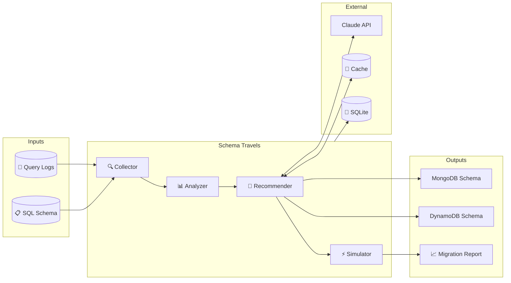
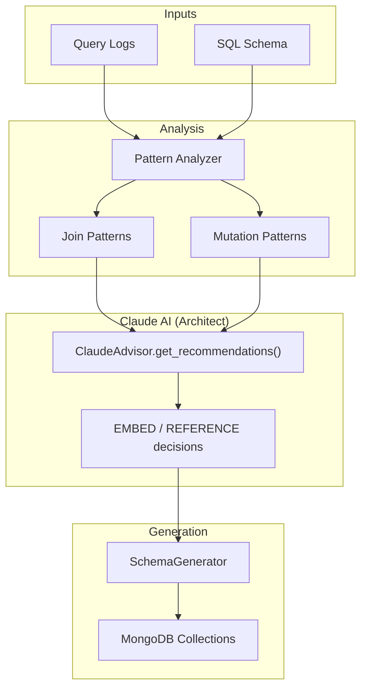
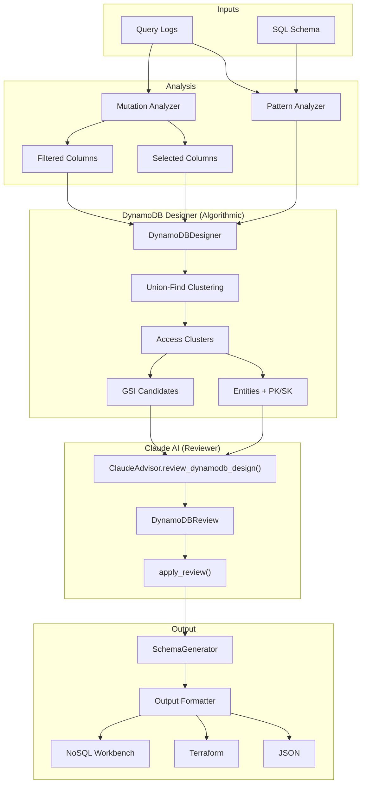
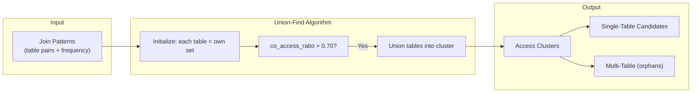
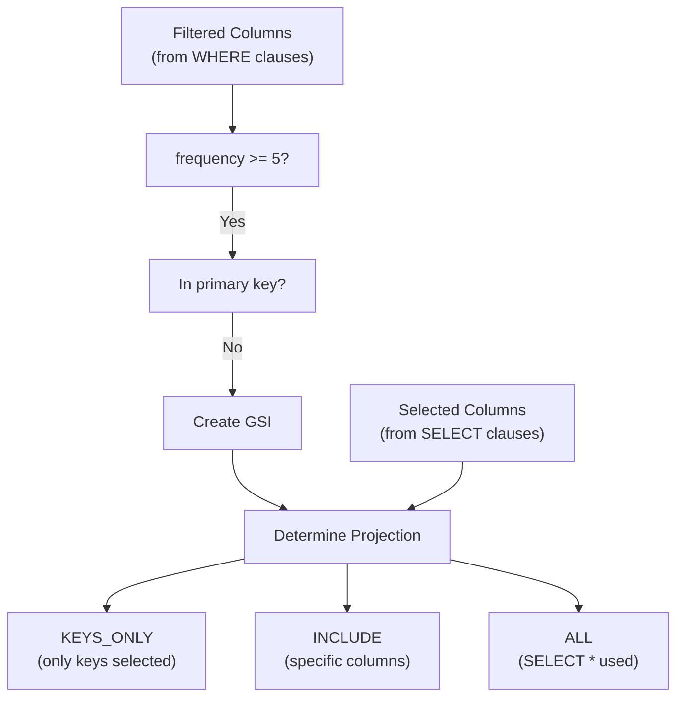
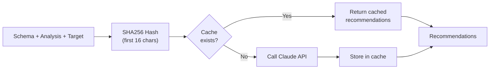

# Architecture

## System Overview


```mermaid
flowchart LR
    subgraph Inputs
        LOGS[("📄 Query Logs")]
        SCHEMA[("📋 SQL Schema")]
    end

    subgraph Core["Schema Travels"]
        direction TB
        C["🔍 Collector"]
        A["📊 Analyzer"]
        R["🤖 Recommender"]
        S["⚡ Simulator"]
        
        C --> A
        A --> R
        R --> S
    end

    subgraph External
        CLAUDE["Claude API"]
        CACHE[("🔄 Cache")]
        DB[("💾 SQLite")]
    end

    subgraph Outputs
        MONGO["MongoDB Schema"]
        DYNAMO["DynamoDB Schema"]
        REPORT["📈 Migration Report"]
    end

    LOGS --> C
    SCHEMA --> C
    R <--> CLAUDE
    R <--> CACHE
    Core --> DB
    S --> REPORT
    R --> MONGO
    R --> DYNAMO
```

## Target-Specific Data Flows

### MongoDB Flow

Claude acts as **architect** — designs the schema from scratch.


```mermaid
flowchart TB
    subgraph Inputs
        LOGS["Query Logs"]
        SCHEMA["SQL Schema"]
    end

    subgraph Analysis
        PA["Pattern Analyzer"]
        JP["Join Patterns"]
        MP["Mutation Patterns"]
    end

    subgraph AI["Claude AI (Architect)"]
        CA["ClaudeAdvisor.get_recommendations()"]
        REC["EMBED / REFERENCE decisions"]
    end

    subgraph Generation
        SG["SchemaGenerator"]
        TS["MongoDB Collections"]
    end

    LOGS --> PA
    SCHEMA --> PA
    PA --> JP
    PA --> MP
    JP --> CA
    MP --> CA
    CA --> REC
    REC --> SG
    SG --> TS
```

### DynamoDB Flow (v2.0.0+)

Claude acts as **reviewer** — validates and refines local algorithmic design.


```mermaid
flowchart TB
    subgraph Inputs
        LOGS["Query Logs"]
        SCHEMA["SQL Schema"]
    end

    subgraph Analysis
        PA["Pattern Analyzer"]
        MA["Mutation Analyzer"]
        SC["Selected Columns"]
        FC["Filtered Columns"]
    end

    subgraph LocalDesign["DynamoDB Designer (Algorithmic)"]
        DD["DynamoDBDesigner"]
        UF["Union-Find Clustering"]
        AC["Access Clusters"]
        ENT["Entities + PK/SK"]
        GSI["GSI Candidates"]
    end

    subgraph AIReview["Claude AI (Reviewer)"]
        CR["ClaudeAdvisor.review_dynamodb_design()"]
        REV["DynamoDBReview"]
        AR["apply_review()"]
    end

    subgraph Output
        SG["SchemaGenerator"]
        FMT["Output Formatter"]
        JSON["JSON"]
        TF["Terraform"]
        NSW["NoSQL Workbench"]
    end

    LOGS --> PA
    LOGS --> MA
    SCHEMA --> PA
    MA --> SC
    MA --> FC
    PA --> DD
    SC --> DD
    FC --> DD
    DD --> UF
    UF --> AC
    AC --> ENT
    AC --> GSI
    ENT --> CR
    GSI --> CR
    CR --> REV
    REV --> AR
    AR --> SG
    SG --> FMT
    FMT --> JSON
    FMT --> TF
    FMT --> NSW
```

## Module Details

### Collector (`collector/`)

| File | Purpose |
|------|---------|
| `log_parser.py` | Parse PostgreSQL/MySQL query logs |
| `schema_parser.py` | Parse SQL DDL schemas |
| `models.py` | Data models (QueryLog, SchemaDefinition) |

### Analyzer (`analyzer/`)

| File | Purpose |
|------|---------|
| `hot_joins.py` | Detect frequently joined tables |
| `mutations.py` | Track read/write ratios; **v2.0.0**: SELECT/WHERE columns |
| `pattern_analyzer.py` | Combine patterns, calculate co-access |
| `models.py` | Analysis data models |

### Recommender (`recommender/`)

| File | Purpose |
|------|---------|
| `claude_advisor.py` | AI recommendations (MongoDB) + **v2.0.1**: AI review (DynamoDB) |
| `schema_generator.py` | Generate MongoDB/DynamoDB schemas |
| `cache.py` | Hash-based recommendation caching |
| `query_rewriter.py` | SQL → MongoDB query rewrite examples |
| `models.py` | Recommendation data models |
| `dynamodb_models.py` | **v2.0.0**: DynamoDB design models |
| `dynamodb_designer.py` | **v2.0.0**: Algorithmic DynamoDB design |
| `dynamodb_output.py` | **v2.0.0**: JSON/Terraform/NoSQL Workbench formatters |
| `dynamodb_review.py` | **v2.0.1**: Apply AI review to design |

### Simulator (`simulator/`)

| File | Purpose |
|------|---------|
| `cost_model.py` | Storage/compute cost calculations |
| `simulator.py` | Migration impact estimation |

### Persistence (`persistence/`)

| File | Purpose |
|------|---------|
| `database.py` | SQLite connection management |
| `repository.py` | CRUD operations for analyses |

## DynamoDB Design Algorithm (v2.0.0)

### Access Cluster Detection


```mermaid
flowchart LR
    subgraph Input
        JP["Join Patterns<br/>(table pairs + frequency)"]
    end

    subgraph UnionFind["Union-Find Algorithm"]
        INIT["Initialize: each table = own set"]
        THRESH["co_access_ratio > 0.70?"]
        MERGE["Union tables into cluster"]
    end

    subgraph Output
        AC["Access Clusters"]
        ST["Single-Table Candidates"]
        MT["Multi-Table (orphans)"]
    end

    JP --> INIT
    INIT --> THRESH
    THRESH -->|Yes| MERGE
    MERGE --> AC
    AC --> ST
    AC --> MT
```

### GSI Selection


```mermaid
flowchart TB
    FC["Filtered Columns<br/>(from WHERE clauses)"]
    SC["Selected Columns<br/>(from SELECT clauses)"]
    
    FREQ["frequency >= 5?"]
    INPK["In primary key?"]
    
    GSI["Create GSI"]
    PROJ["Determine Projection"]
    
    KEYS["KEYS_ONLY<br/>(only keys selected)"]
    INCL["INCLUDE<br/>(specific columns)"]
    ALL["ALL<br/>(SELECT * used)"]

    FC --> FREQ
    FREQ -->|Yes| INPK
    INPK -->|No| GSI
    GSI --> PROJ
    SC --> PROJ
    PROJ --> KEYS
    PROJ --> INCL
    PROJ --> ALL
```

## Storage Layout

```
~/.schema-travels/
├── schema_travels.db           # Analysis history (SQLite)
└── cache/
    ├── index.json              # Cache metadata
    ├── a1b2c3d4.json           # MongoDB recommendations
    ├── e5f6g7h8.json           # Another cached result
    └── a1b2c3d4_review.json    # v2.0.1: DynamoDB AI review
```

## Cache Flow


```mermaid
flowchart LR
    INPUT["Schema + Analysis + Target"]
    HASH["SHA256 Hash<br/>(first 16 chars)"]
    CHECK{"Cache<br/>exists?"}
    HIT["Return cached<br/>recommendations"]
    MISS["Call Claude API"]
    STORE["Store in cache"]
    OUTPUT["Recommendations"]

    INPUT --> HASH
    HASH --> CHECK
    CHECK -->|Yes| HIT
    CHECK -->|No| MISS
    MISS --> STORE
    HIT --> OUTPUT
    STORE --> OUTPUT
```

### Cache Keys by Target

| Target | Cache Key | Contents |
|--------|-----------|----------|
| MongoDB | `{hash}` | EMBED/REFERENCE recommendations |
| DynamoDB | `{hash}` | Not used (algorithmic design) |
| DynamoDB | `{hash}_review` | AI review of local design |

### Cache Invalidation

Cache entries are invalidated when:
1. `RECOMMENDATION_VERSION` is bumped in `cache.py`
2. User passes `--no-cache` flag
3. User passes `--clear-cache` flag
4. Cache file is manually deleted

## AI Integration Patterns

### MongoDB: Claude as Architect

```
Input:  Schema + Access Patterns
Prompt: "Design optimal MongoDB schema"
Output: EMBED/REFERENCE decisions per relationship
```

### DynamoDB: Claude as Reviewer

```
Input:  Local design from DynamoDBDesigner
Prompt: "Review this design for issues"
Output: Approval + suggested changes (entity PK/SK, GSIs)
```

## Key Thresholds

| Constant | Value | Location | Purpose |
|----------|-------|----------|---------|
| `CO_ACCESS_THRESHOLD` | 0.70 | `dynamodb_designer.py` | Min ratio for single-table clustering |
| `HOT_JOIN_THRESHOLD` | 3 | `dynamodb_designer.py` | Min joins to consider relationship |
| `GSI_FREQUENCY_THRESHOLD` | 5 | `dynamodb_designer.py` | Min filter frequency for GSI |
| `MAX_GSIS` | 5 | `dynamodb_designer.py` | DynamoDB limit per table |