# Architecture

## System Overview

```mermaid
flowchart LR
    subgraph Inputs
        LOGS[("📄 Query Logs")]
        SCHEMA[("📋 SQL Schema")]
    end

    subgraph Core["Schema Travels"]
        direction TB
        C["🔍 Collector"]
        A["📊 Analyzer"]
        R["🤖 Recommender"]
        S["⚡ Simulator"]
        
        C --> A
        A --> R
        R --> S
    end

    subgraph External
        CLAUDE["Claude API"]
        CACHE[("🔄 Cache")]
        DB[("💾 SQLite")]
    end

    subgraph Outputs
        MONGO["MongoDB Schema"]
        REPORT["📈 Migration Report"]
    end

    LOGS --> C
    SCHEMA --> C
    R <--> CLAUDE
    R <--> CACHE
    Core --> DB
    S --> REPORT
    R --> MONGO
```



## Detailed Data Flow


## Module Details

### Collector (`collector/`)

| File | Purpose |
|------|---------|
| `log_parser.py` | Parse PostgreSQL/MySQL query logs |
| `schema_parser.py` | Parse SQL DDL schemas |
| `models.py` | Data models (QueryLog, SchemaDefinition) |

### Analyzer (`analyzer/`)

| File | Purpose |
|------|---------|
| `hot_joins.py` | Detect frequently joined tables |
| `mutations.py` | Track read/write ratios per table |
| `pattern_analyzer.py` | Combine patterns, calculate co-access |

### Recommender (`recommender/`)

| File | Purpose |
|------|---------|
| `claude_advisor.py` | AI recommendations via Claude API |
| `schema_generator.py` | Generate MongoDB/DynamoDB schemas |
| `cache.py` | **v1.1.0** - Hash-based recommendation caching |
| `models.py` | Recommendation data models |

### Simulator (`simulator/`)

| File | Purpose |
|------|---------|
| `cost_model.py` | Storage/compute cost calculations |
| `simulator.py` | Migration impact estimation |

### Persistence (`persistence/`)

| File | Purpose |
|------|---------|
| `database.py` | SQLite connection management |
| `repository.py` | CRUD operations for analyses |

## Storage Layout

```
~/.schema-travels/
├── schema_travels.db           # Analysis history (SQLite)
└── cache/
    ├── index.json              # Cache metadata
    │   {
    │     "entries": {
    │       "a1b2c3d4": {
    │         "version": "1.0.0",
    │         "model": "claude-sonnet-4-20250514",
    │         "timestamp": "2025-02-26T10:30:00",
    │         "num_recommendations": 5
    │       }
    │     }
    │   }
    ├── a1b2c3d4.json           # Cached recommendations
    └── e5f6g7h8.json           # Another cached result
```

## Cache Flow (v1.1.0)


### Cache Invalidation

Cache entries are invalidated when:
1. `RECOMMENDATION_VERSION` is bumped in `cache.py`
2. User passes `--no-cache` flag
3. User passes `--clear-cache` flag
4. Cache file is manually deleted
